# 공냥이 시각 콘텐츠 스킬

컨설팅 스타일 차트, 인스타그램 카드뉴스, 애니메이션 영상을 HTML/CSS 코드로 생성하는 Claude Code 스킬입니다.

3가지 기능:
- **공냥이 차트** — 컨설팅 스타일 데이터 차트
- **공냥이 카드뉴스** — 인스타 카드뉴스 5가지 디자인
- **공냥이 영상** — Remotion 애니메이션 차트

## 이런 걸 만듭니다

### 1. 공냥이 차트 (960x500)
McKinsey/Bain 스타일 데이터 차트. HTML로 생성하고 Chrome headless로 PNG 변환.

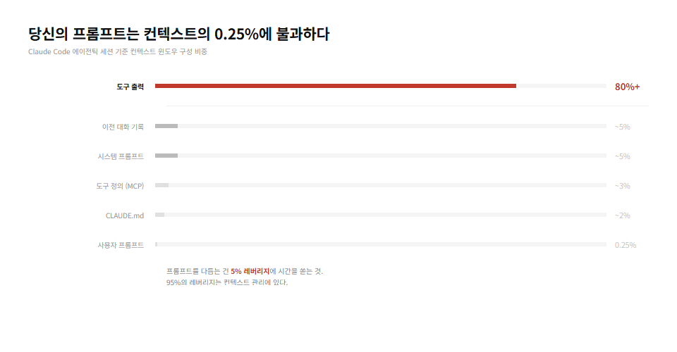
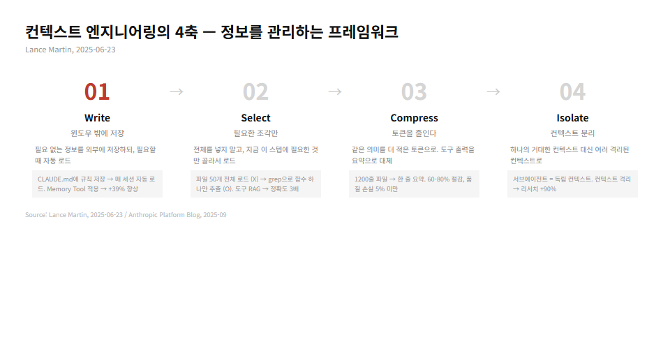
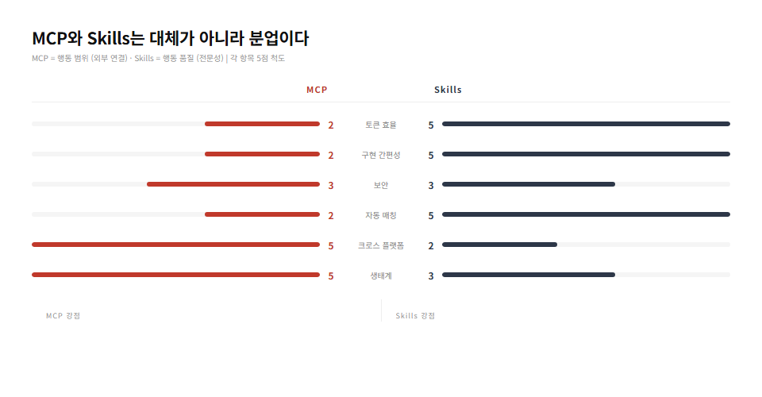

**지원 차트 유형:**
- 수평 바 차트 (슬림 6px, 강조색 1개)
- 비교표 (테이블)
- A vs B 양방향 비교
- 프로세스/흐름도
- 타임라인
- 레벨/계단형

### 2. 공냥이 카드뉴스 (1080x1350, 5가지 디자인)
인스타그램 4:5 포트레이트. 5가지 디자인 테마 중 선택 가능.

| 테마 | 설명 | 예시 |
|------|------|------|
| **editorial** | 좌측정렬 매거진, 라이트 배경 | 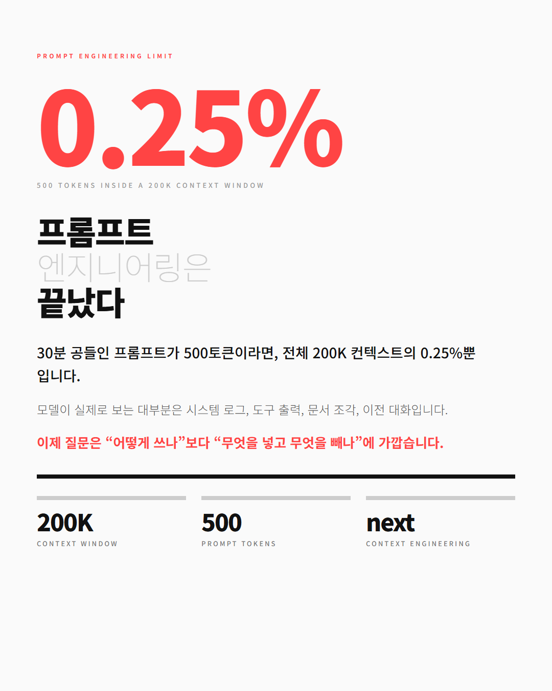 |
| **impact** | 다크 배경, 중앙 극적 임팩트 (기본값) | 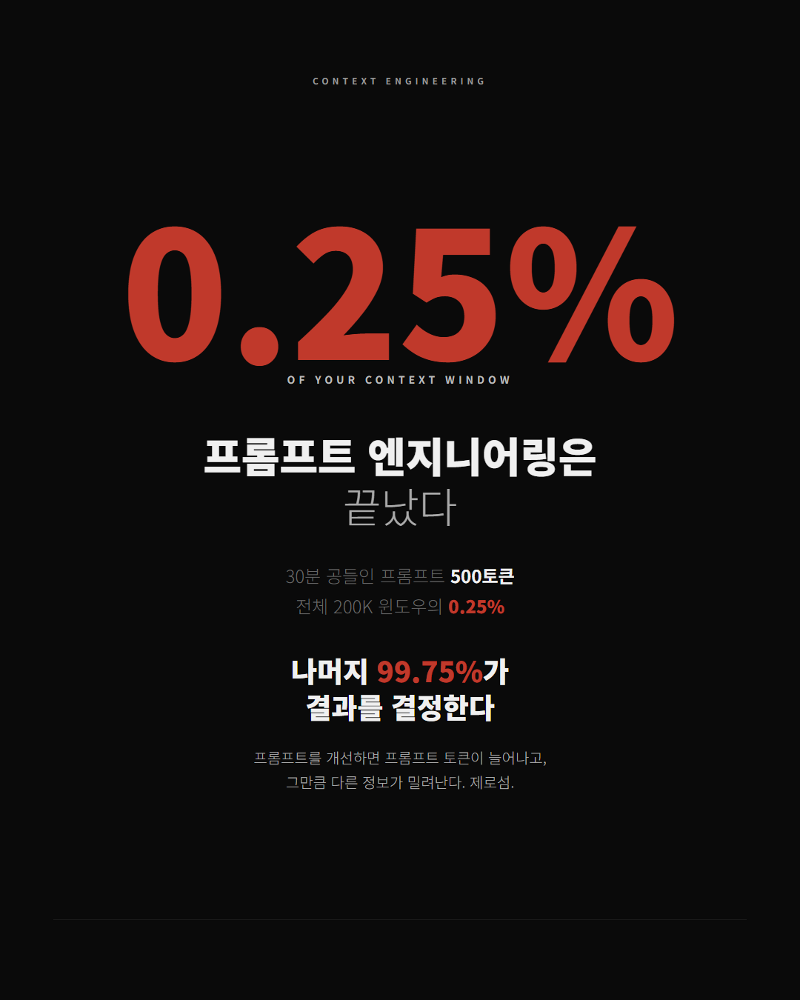 |
| **grid** | 좌우 2단 분할, 어스톤 색상 | 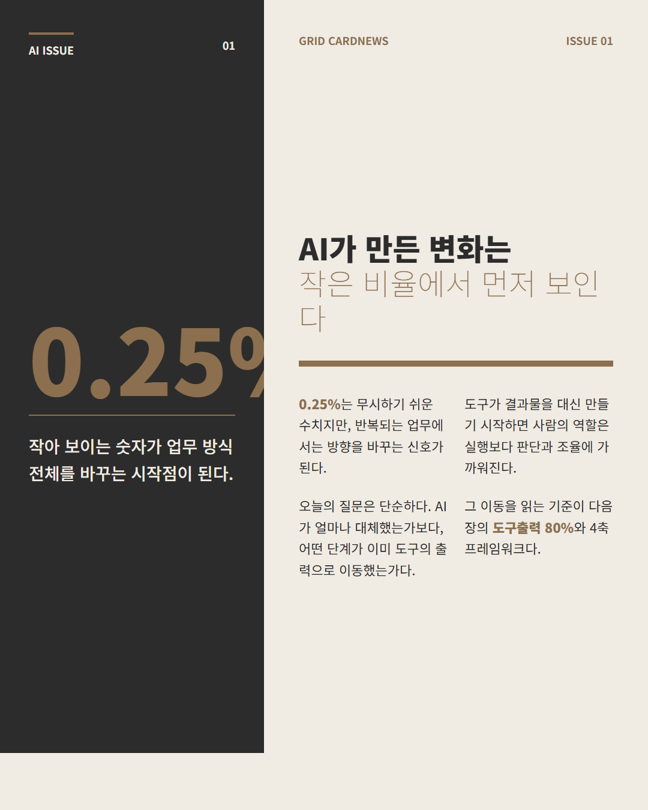 |
| **dark-slim** | 다크 배경, 슬림 차트 | 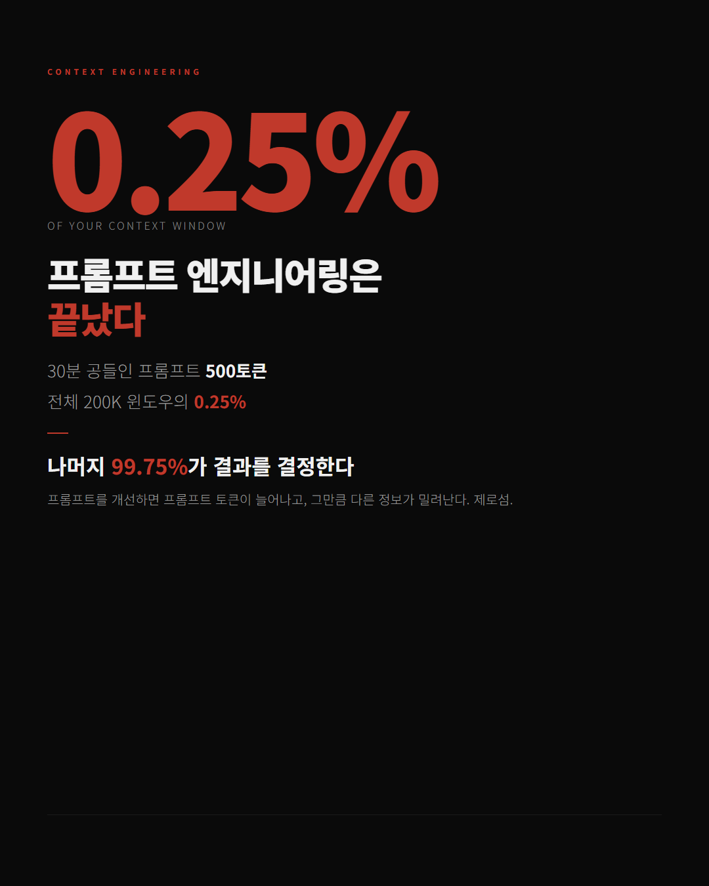 |
| **minimal** | 흑백 미니멀, 중앙정렬 | 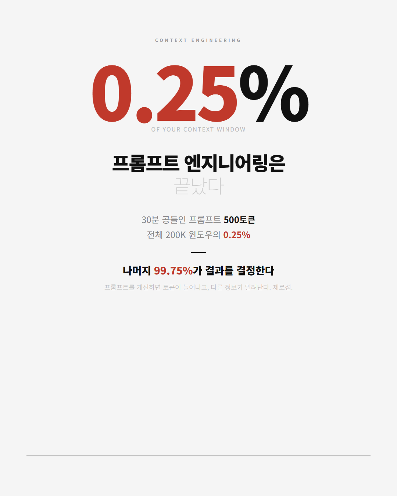 |

**데이터 슬라이드 (바 차트 포함):**

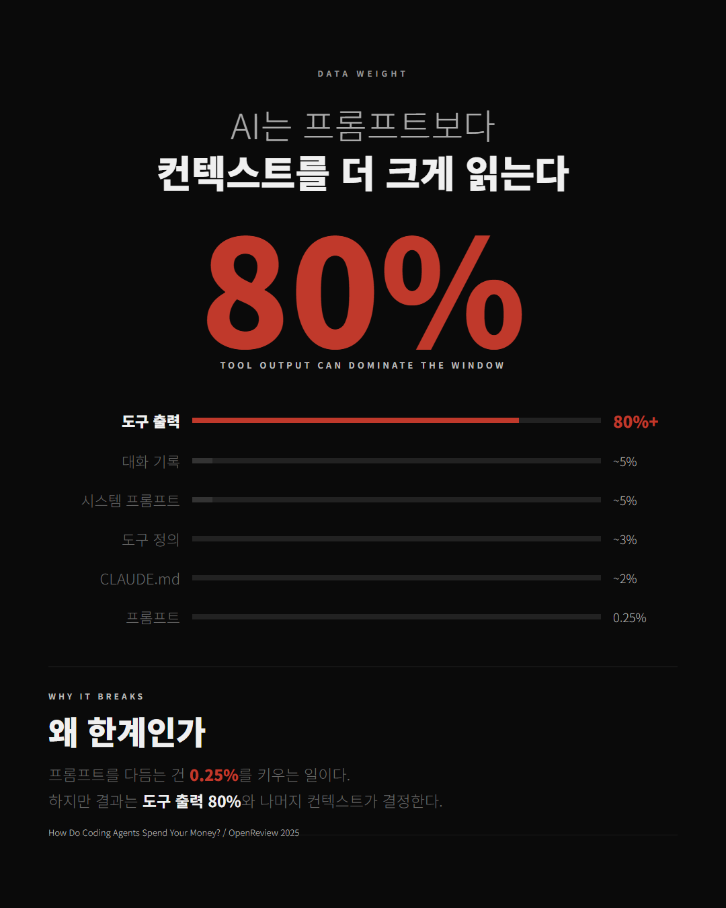
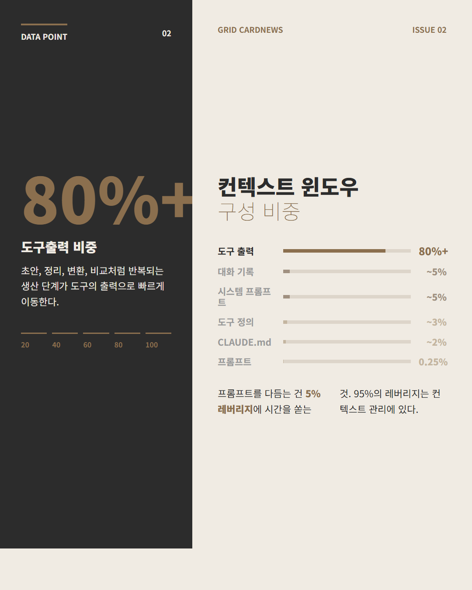

### 3. 공냥이 영상 (Remotion)
React + Remotion으로 차트 애니메이션을 MP4/GIF로 렌더링.

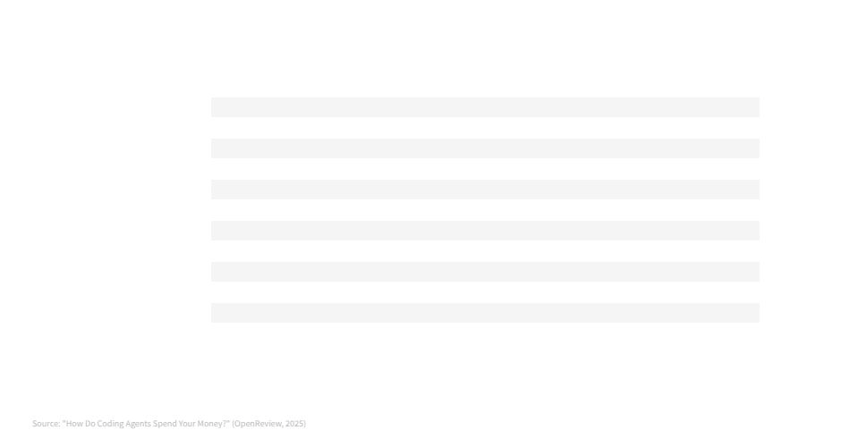
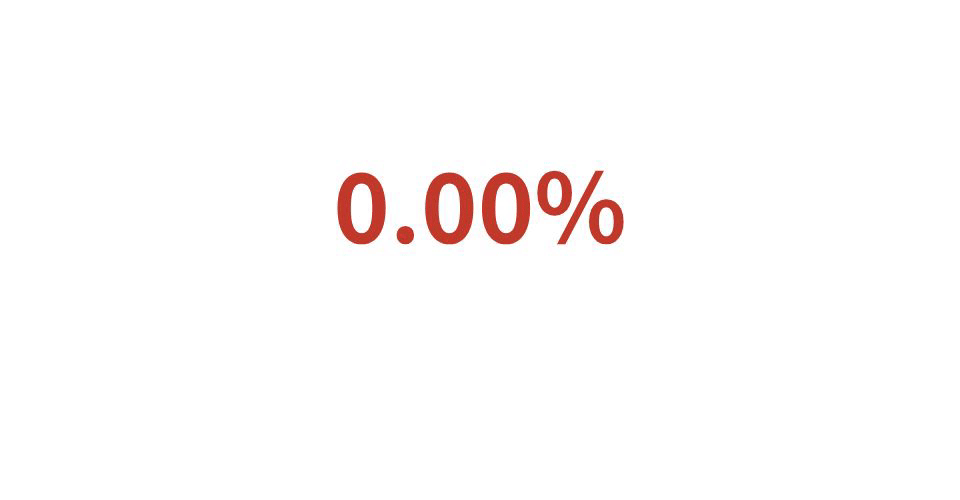

- 바가 0에서 쫙 올라오는 애니메이션
- 숫자가 0에서 카운트업
- 프레임워크 요소가 순차 등장
- spring() 물리 기반 자연스러운 모션
- MP4, GIF 출력

## 설치

```bash
git clone https://github.com/kimsh-1/gongnangi-chart-skill.git
cd gongnangi-chart-skill
bash install.sh
```

설치 스크립트가 자동으로:
- 스킬 파일을 `~/.claude/skills/consulting-chart/`에 복사
- Node.js, Chrome, ffmpeg 설치 여부 확인
- 누락된 의존성 안내

### 설치 후 테스트

```bash
bash test.sh
```

테스트 항목:
- 스킬 파일 존재 확인
- Node.js/Chrome/ffmpeg 설치 확인
- HTML → PNG 렌더 테스트 (Chrome headless)

### 의존성

| 도구 | 용도 | 필수 여부 |
|------|------|----------|
| **Node.js 18+** | Remotion 렌더 | 영상 기능 사용 시 필수 |
| **Chrome** | HTML → PNG 변환 | 필수 |
| **ffmpeg** | GIF/MP4 인코딩 | 영상 기능 사용 시 필수 |
| **Remotion** | React 영상 생성 | 영상 기능 사용 시 자동 설치 |

WSL 환경에서는 Windows Chrome을 자동 감지합니다.

## 사용법

Claude Code에서:

```
# 차트 생성
/consulting-chart 매출 성장률 비교 차트 만들어줘
/consulting-chart 컨텍스트 윈도우 구성 비중 바 차트

# 카드뉴스 생성 (디자인 선택)
/consulting-chart impact 스타일로 카드뉴스 만들어줘
/consulting-chart grid 디자인으로 4축 프레임워크 카드뉴스
/consulting-chart 카드뉴스 만들어줘  (기본값: impact)

# 애니메이션 영상
/consulting-chart 바 차트 올라가는 영상 만들어줘
/consulting-chart 숫자 카운트업 GIF 만들어줘
```

## 디자인 원칙

McKinsey/Bain/BCG 컨설팅 보고서 기준:

1. **색상**: 기본 전부 회색/검정. 강조는 빨강(#c0392b) 하나만.
2. **장식 제로**: 이모지, 그라데이션, 둥근 모서리, 그림자, 박스 테두리 없음.
3. **타이포**: 제목 = 인사이트(설명이 아님). 숫자가 크고, 라벨이 작다.
4. **Action Title**: "매출 추이" (X) → "Q4 매출 15% 급등" (O)
5. **Source**: 하단에 반드시 출처 한 줄.

### 카드뉴스 타이포그래피

```
핵심 숫자: 160-200px, weight 900
제목 핵심: 48-56px, weight 900
제목 연결어: 같은 크기, weight 100-300 (대비)
본문: 22-28px, line-height × 1.618 (황금비)
라벨: 11-13px, letter-spacing 3-5px
```

- 한 줄마다 다른 크기/굵기/색상
- 콘텐츠가 캔버스의 70%+ 차지
- safe zone 상하 135px (인스타 그리드 잘림 방지)

### 품질 보증 (피드백 루프)

카드뉴스 렌더 후 자동 검증:
1. **잘림 체크** — 2배 높이 렌더로 하단 오버플로 감지
2. **시각 확인** — 텍스트 가독성, 빈 공간 비율, 바 차트 스타일 확인
3. **자동 수정** — 실패 시 색상/크기 조정 후 재렌더 (최대 3회)

## 파일 구조

```
gongnangi-chart-skill/
├── SKILL.md              Claude Code 스킬 정의 (핵심)
├── README.md             이 문서
├── LICENSE               MIT
├── install.sh            자동 설치 스크립트
├── test.sh               사전 테스트 스크립트
├── examples/
│   ├── bar-chart.html           바 차트 예제
│   ├── comparison-table.html    비교표 예제
│   ├── process-flow.html        프로세스 흐름 예제
│   ├── animated-barchart.html   CSS 애니메이션 바 차트
│   ├── animated-4axis.html      CSS 애니메이션 4축
│   └── cardnews/
│       ├── editorial-cover.html   에디토리얼 테마
│       ├── impact-cover.html      임팩트 테마
│       ├── grid-cover.html        그리드 테마
│       ├── dark-slim-cover.html   다크 슬림 테마
│       └── minimal-cover.html     미니멀 테마
└── output-samples/              실제 출력물 예시
    ├── charts/                  차트 PNG
    ├── animation/               Remotion GIF
    ├── cardnews-editorial/      에디토리얼 카드뉴스
    ├── cardnews-impact/         임팩트 카드뉴스
    ├── cardnews-grid/           그리드 카드뉴스
    ├── cardnews-dark-slim/      다크 슬림 카드뉴스
    └── cardnews-minimal/        미니멀 카드뉴스
```

## 라이선스

MIT
